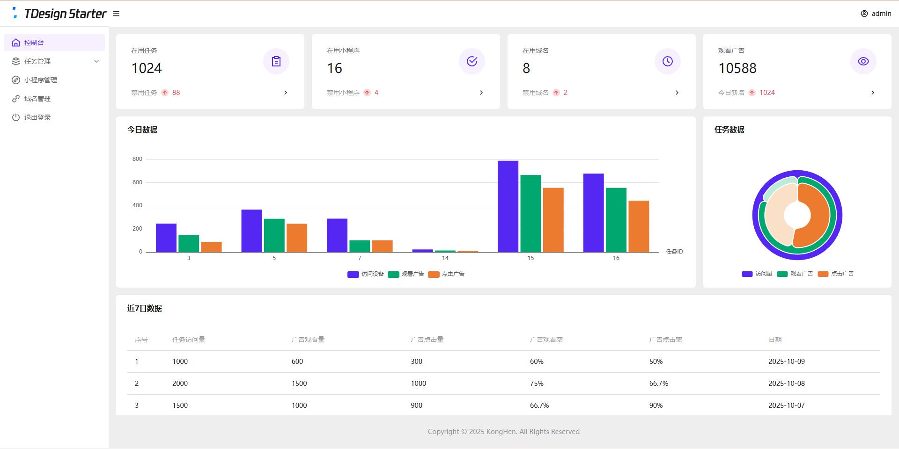
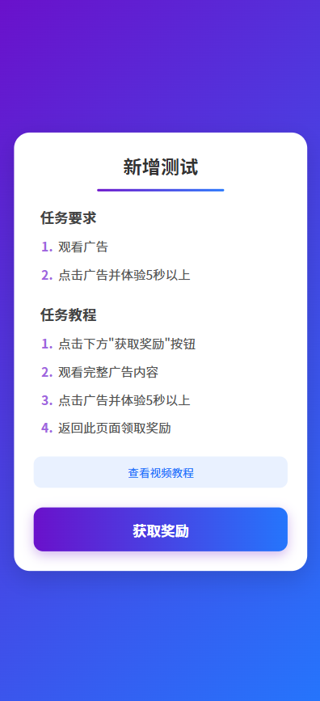

# 空痕流量变现系统(任务管理系统)

## 项目简介
### 项目结构：
1. 接口管理：PHP + Mysql
2. 后台管理系统：Vue3 + ts + TDesign
3. 任务单页：Vue3
4. 小程序：uniapp + Vue2

### 变现说明：
1. 基础流程：
- 后台创建任务
- 复制任务链接
- 分享到社群或私域
- 用户打开任务页面
- 跳转到小程序观看广告
- 观看广告
- 下发奖励

2. 收入来源
- 微信小程序官方广告收入
- 其他收入

## 系统演示
### 演示站点
[空痕任务管理系统](https://task.dev.xma.run)

### 演示图片
1. 管理后台


2. 任务单页


3. 小程序


## 安装教程
### 管理后台

1. 安装依赖
```bash
npm install
```

2. 构建项目
```bash
npm run build
```

3. 新建站网站及数据库
- 推荐：PHP 8.0
- 推荐：Mysql 5.7
- 开启SSL(必须)
- 配置伪静态
```html
location / {
    try_files $uri $uri/ /index.html;
}

location /api/ {
    if (!-e $request_filename) {
        rewrite ^/(.*)$ /$1.php last;
    }
}
```

4. 导入数据库
- 导入`/后台/数据库/task_dev_xma_run.sql`到Mysql数据库

5. 修改`/后台/api/config.php`
- 管理账户密码
- JWT配置(密钥、过期时间)
- 数据库配置

6. 上传后台代码
- 上传`/后台/dist`目录中的全部文件到网站根目录
- 上传`/后台/api`目录到网站根目录

### 任务单页

1. 安装依赖
```bash
npm install
```

2. 修改`/任务单页/src/App.vue`中的接口信息
- 修改后台地址
- 修改视频教程地址

3. 构建项目
```bash
npm run build
```

4. 新建网站
- 静态网站
- 开启SSL(必须)

5. 上传任务单页代码
- 上传`/任务单页/dist`目录中的全部文件到网站根目录


### 小程序

1. 使用`HbuildX`打开小程序

2. 在`manifest.json`中获取新AppID

3. 修改`/pages/user/view`中的后台地址

4. 修改`/pages/user/work`中的二维码

5. 发行到微信小程序

6. 在微信开发者工具中上传代码

7. 登录微信小程序后台配置
- 配置`request合法域名`
```html
https://task.dev.xma.run
https://www.duitang.com
```
- 配置`downloadFile合法域名`
```html
https://c-ssl.duitang.com
```

8. 配置`明文scheme拉起此小程序`
```html
pages/user/view;pages/user/work
```